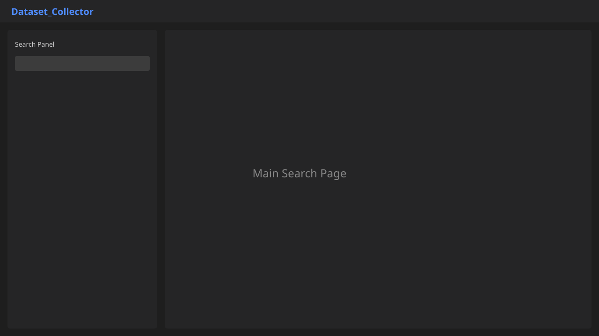
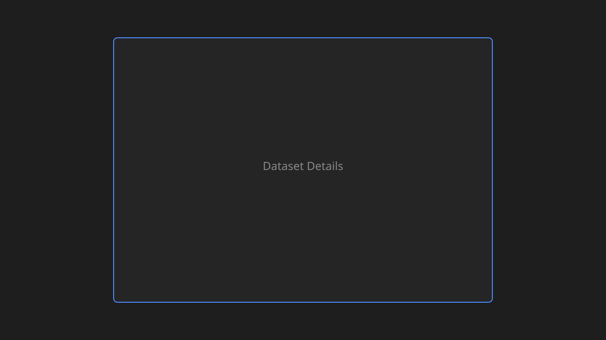
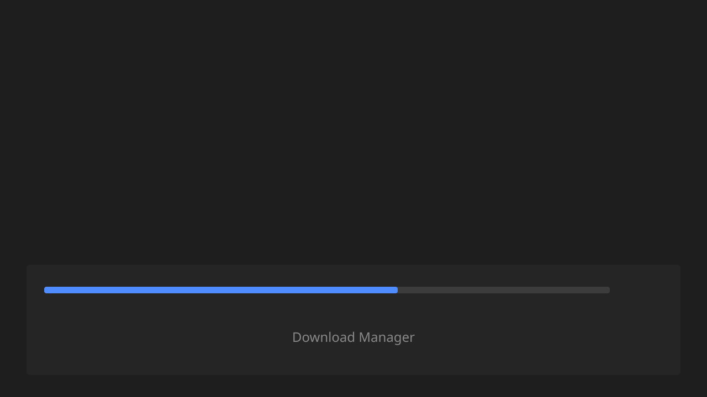
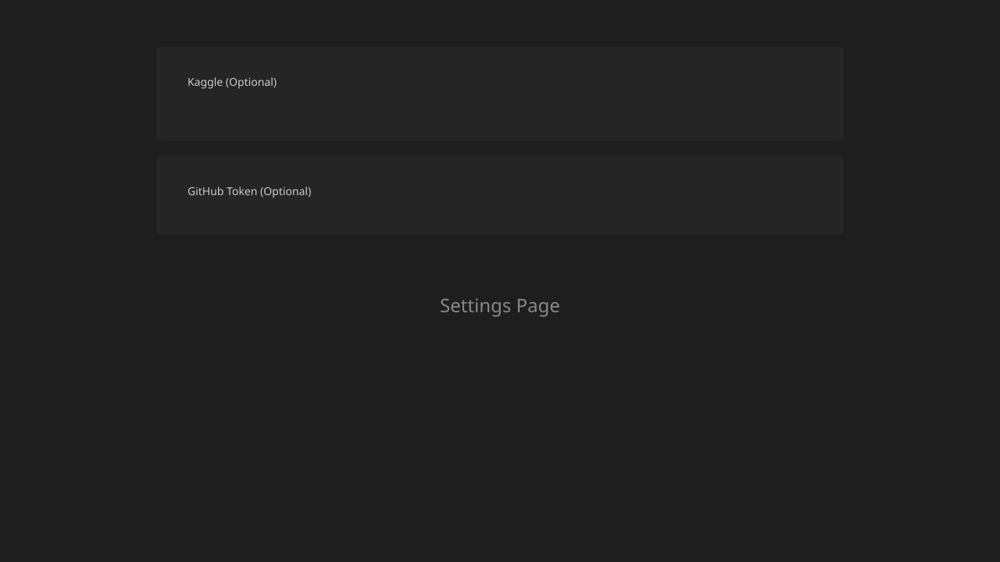
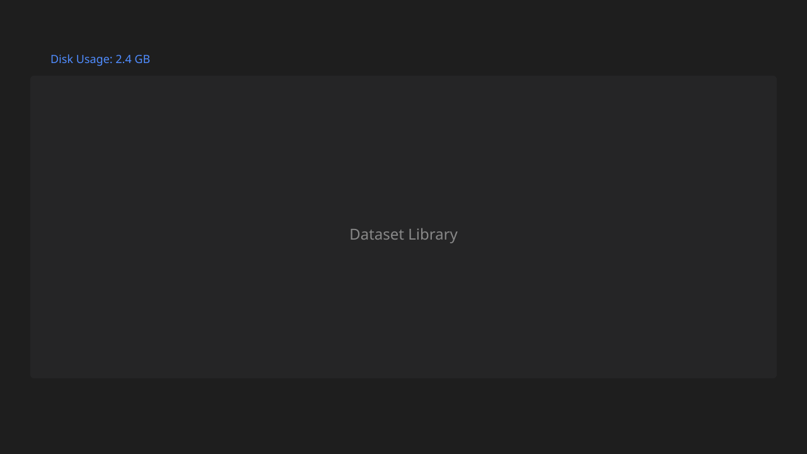

<div align="center">

# Dataset_Collector

**Discover, analyze, and download datasets from multiple sources through a single interface.**

[](LICENSE)
[](https://www.python.org/)
[](https://github.com/brovk2008/Dataset_collector/releases/latest)
[](https://github.com/brovk2008/Dataset_collector/releases)
[](https://github.com/brovk2008/Dataset_collector/releases)

No Python installation required for Windows releases.

</div>

---

## Download Latest Release

| | |
|---|---|
| **Windows Installer** | [Dataset_Collector_Setup.exe](https://github.com/brovk2008/Dataset_collector/releases/latest/download/Dataset_Collector_Setup.exe) |
| **Portable Version** | [Dataset_Collector_Portable.zip](https://github.com/brovk2008/Dataset_collector/releases/latest/download/Dataset_Collector_Portable.zip) |
| **Source Code** | [GitHub Repository](https://github.com/brovk2008/Dataset_collector) |

> **First release?** Create a tag (e.g. `v1.0.0`) and GitHub Actions will automatically build and attach the Windows EXE and portable ZIP.

**Support the project:** [Donate via Razorpay](https://rzp.io/rzp/ABzyauZu)

---

## Screenshots

| Main Search | Results |
|:---:|:---:|
|  |  |

| Dataset Details | Download Manager |
|:---:|:---:|
|  |  |

| Settings | Library |
|:---:|:---:|
|  |  |

---

## Features

| Feature | Description |
|---------|-------------|
| **Multi-source search** | Kaggle, GitHub, Hugging Face, Government portals, Research repos, Internet Archive, Google Dataset Search |
| **Intelligent ranking** | Composite relevance score (0–100) based on query match, popularity, recency, and credibility |
| **Quality scoring** | Per-dataset quality metric (0–10) for documentation, metadata, and availability |
| **Duplicate detection** | Merges the same dataset found across multiple sources into one entry |
| **Dataset comparison** | Side-by-side compare size, license, quality, and sources (2–5 datasets) |
| **Download queue** | Pause, resume, cancel, retry failed; live speed, ETA, and remaining size |
| **Auto profiling** | CSV, image, and text analysis saved locally after each download |
| **Encrypted credentials** | Optional Kaggle, GitHub, Hugging Face tokens stored securely |
| **Public-first access** | Works immediately without API keys for public datasets |
| **Library management** | Search, sort, open folder, export metadata, delete datasets |
| **System health** | Connector status, queue info, log export as ZIP |

---

## Supported Sources

| Source | Search | Download | Auth Required |
|--------|:------:|:--------:|:-------------:|
| Kaggle | ✅ | ✅ | Optional (recommended for search) |
| GitHub | ✅ | ✅ | Optional (higher rate limits) |
| Hugging Face | ✅ | ✅ | Only for private/gated |
| Government Data | ✅ | ✅ | Public access mode by default |
| Research (Zenodo, etc.) | ✅ | ✅ | No |
| Internet Archive | ✅ | Partial | No |
| Google Dataset Search | ✅ | Via source URL | No |

---

## Installation

### Option 1 — Windows Installer (Recommended)

1. Download [Dataset_Collector_Setup.exe](https://github.com/brovk2008/Dataset_collector/releases/latest/download/Dataset_Collector_Setup.exe)
2. Run the executable
3. Start searching — no configuration needed

### Option 2 — Portable ZIP

1. Download [Dataset_Collector_Portable.zip](https://github.com/brovk2008/Dataset_collector/releases/latest/download/Dataset_Collector_Portable.zip)
2. Extract anywhere
3. Run `Dataset_Collector.exe`

### Option 3 — Build from Source

```bash
git clone https://github.com/brovk2008/Dataset_collector.git
cd Dataset_collector

python -m venv venv
venv\Scripts\activate        # Windows
# source venv/bin/activate   # macOS/Linux

pip install -r requirements.txt
pip install -e .
python run.py
```

### Build Windows Release Locally

```bash
pip install -r requirements.txt
python scripts/build_windows.py
```

Outputs: `dist/Dataset_Collector_Setup.exe` and `dist/Dataset_Collector_Portable.zip`

---

## Quick Start

1. **Launch** Dataset_Collector
2. **Enter a query** — e.g. `medical images`, `sentiment analysis`, `crime statistics`
3. **Select sources** and file types (or leave defaults)
4. **Click Scan Sources** — results are ranked by relevance and quality
5. **Select datasets** (or use size-budget auto-select)
6. **Generate Manifest** (optional) then **Download Selected**
7. **View profiles** in Analysis tab — reports saved in each dataset folder
8. **Manage downloads** in the Library tab

---

## Authentication Guide

All authentication is **optional**. The app works out of the box for public datasets.

| Provider | When Needed | How to Connect |
|----------|-------------|----------------|
| **Kaggle** | Reliable search & authenticated downloads | Settings → Username + API Key → Test Connection |
| **GitHub** | Higher API rate limits | Settings → Personal Access Token |
| **Hugging Face** | Private or gated datasets only | Settings → HF Token |
| **India data.gov.in** | Enhanced catalog access | Settings → API Key (public mode works without it) |

Credentials are encrypted locally at `~/.dataset_collector/credentials.enc` and never logged or exposed.

---

## Architecture

```
Dataset_collector/
├── run.py                          # Launcher
├── build.spec                      # PyInstaller build config
├── scripts/build_windows.py        # Windows release builder
├── .github/workflows/release.yml   # Auto-build on release tags
├── config/default_config.yaml      # User-overridable settings
└── src/dataset_collector/
    ├── core/           Models, config, encrypted credential store
    ├── search/
    │   ├── connectors/ Plugin-style source connectors
    │   ├── relevance.py  Ranking (0–100)
    │   ├── quality.py    Quality scoring (0–10)
    │   └── dedup.py      Cross-source duplicate merging
    ├── download/       Queue engine with pause/resume/cancel
    ├── manifest/       JSON + TXT manifest generation
    ├── analyzer/       CSV, image, text profiling
    ├── storage/        Local library index
    ├── logging/        Structured app logs
    └── ui/             PySide6 desktop interface
```

### Plugin System

Each data source implements `BaseConnector` with `search()` and optional `get_download_urls()`. Register custom connectors via `SearchEngine.register_connector()`.

---

## Roadmap

- AI dataset recommendations
- Dataset quality scoring improvements
- Cloud storage export (S3, GCS)
- Dataset version tracking
- Dataset merging utilities
- Dataset similarity search

---

## Contributing

1. Fork the repository
2. Create a feature branch (`git checkout -b feature/my-feature`)
3. Commit your changes
4. Push and open a Pull Request

Bug reports and feature requests are welcome via [GitHub Issues](https://github.com/brovk2008/Dataset_collector/issues).

---

## Donate

If Dataset_Collector saves you time, consider supporting development:

[](https://rzp.io/rzp/ABzyauZu)

The desktop app also includes a **Donate** button in the header that opens the same page.

---

## License

MIT License — see [LICENSE](LICENSE) for details.
