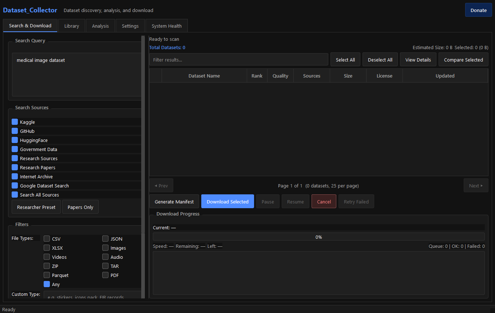
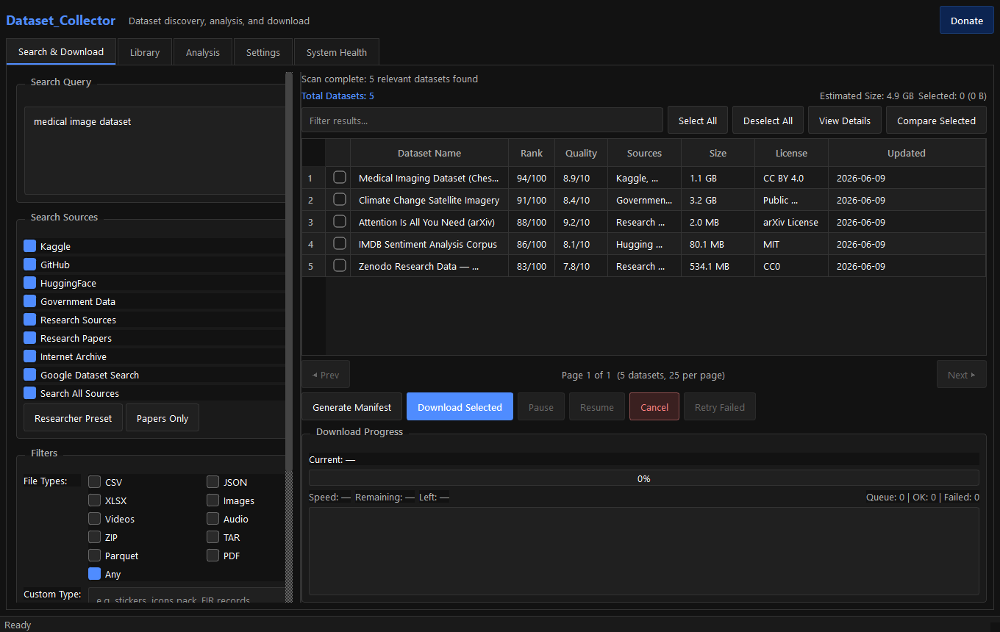
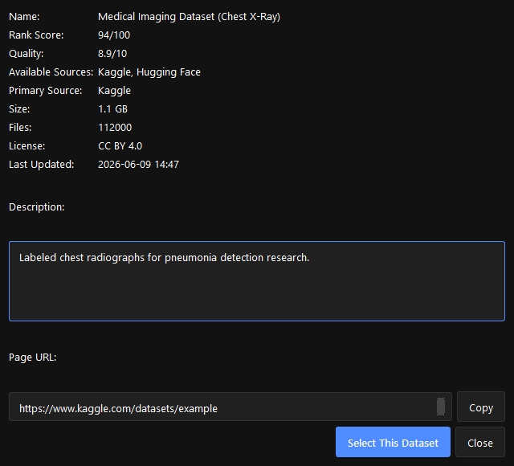
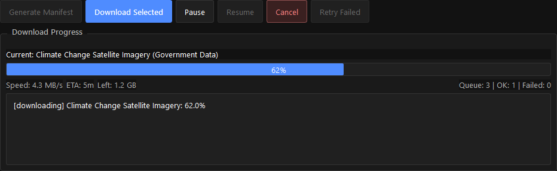
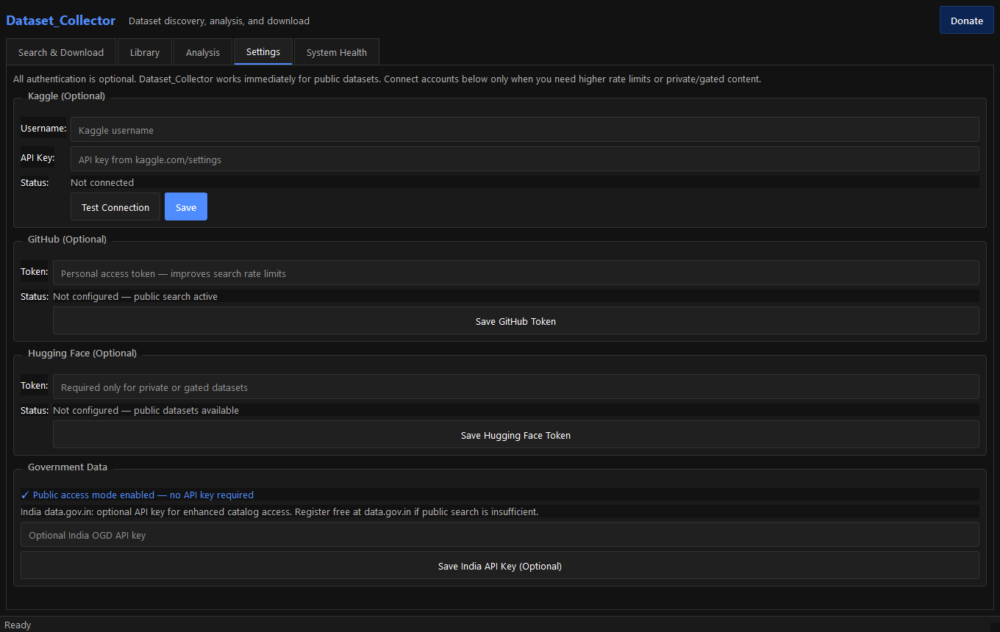
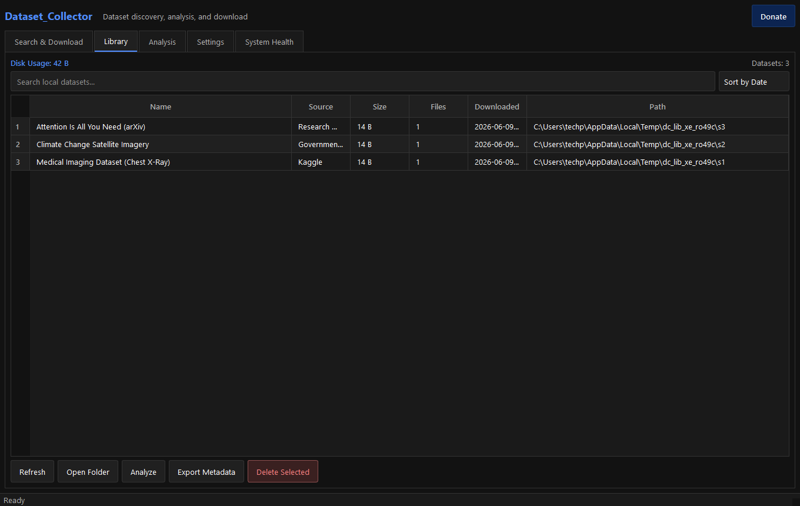

<div align="center">

# Dataset_Collector

**Discover, analyze, and download datasets from multiple sources through a single interface.**

[](LICENSE)
[](https://www.python.org/)
[](https://github.com/brovk2008/Dataset_collector/releases/latest)
[](https://github.com/brovk2008/Dataset_collector/releases)

No Python installation required — download a release for your platform.

</div>

---

## Download Latest Release

**[View all releases →](https://github.com/brovk2008/Dataset_collector/releases)**

| Platform | Download |
|----------|----------|
| **Windows Installer** | [Dataset_Collector_Setup.exe](https://github.com/brovk2008/Dataset_collector/releases/latest/download/Dataset_Collector_Setup.exe) |
| **Windows Portable** | [Dataset_Collector_Portable.zip](https://github.com/brovk2008/Dataset_collector/releases/latest/download/Dataset_Collector_Portable.zip) |
| **macOS** | [Dataset_Collector-macOS.zip](https://github.com/brovk2008/Dataset_collector/releases/latest/download/Dataset_Collector-macOS.zip) |
| **Linux** | [Dataset_Collector-Linux.tar.gz](https://github.com/brovk2008/Dataset_collector/releases/latest/download/Dataset_Collector-Linux.tar.gz) |
| **Source Code** | [GitHub Repository](https://github.com/brovk2008/Dataset_collector) |

> Downloads are built automatically by GitHub Actions when a version tag is pushed. If a link returns 404, check [Actions](https://github.com/brovk2008/Dataset_collector/actions) — the build may still be running.

**Support the project:** [Donate via Razorpay](https://rzp.io/rzp/ABzyauZu)

---

## What's New in v2.0.0 — DatasetBrain Semantic Discovery

### 🎯 Major Features

**Semantic Search with AI-Powered Ranking**
- `sentence-transformers` embeddings for semantic understanding
- Hybrid ranking: **keyword (40%) + semantic (40%) + popularity + freshness + user clicks**
- Finds semantically related datasets, not just keyword matches
- Example: Search "anime" → finds anime subtitles + anime dialogue datasets + related research papers

**User Behavior Learning**
- Track search history and click patterns
- Boost ranking of frequently clicked datasets automatically
- "People Also Downloaded" shows co-occurrence patterns
- Personalized dataset recommendations

**Search Analytics Dashboard**
- Top searches (30 days)
- Most clicked datasets
- Search effectiveness metrics
- Model statistics and cache info

**Enhanced Dataset Health Score (0–100)**
- Metadata completeness
- Documentation quality
- Download availability
- Update recency
- Popularity scoring
- Color-coded display in results

**Local ML Without Cloud APIs**
- 384-dim embeddings cached locally (SQLite)
- Model auto-downloads on first use (~90 MB)
- No internet required after initial download
- Zero telemetry, fully private

**Improved UI/UX**
- Score breakdown modal — see exactly why a result ranked #N
- Adaptive layouts for small windows
- Scrollable settings panel
- Better button organization

### 🐛 Bug Fixes & Improvements

| Issue | Fix |
|-------|-----|
| **App startup hang** | Deferred DatasetBrain initialization + TYPE_CHECKING guards |
| **Circular imports** | Fixed import chains with lazy loading pattern |
| **UI text cutoff** | Reorganized buttons across multiple rows |
| **Window resize issues** | Better minimum size + flexible column widths |
| **Missing dependencies** | Added cryptography to requirements |

### 📊 What's Under the Hood

New components:
- `databrain/` — Semantic discovery subsystem
- `embeddings_cache.py` — SQLite for 384-dim vectors
- `user_behavior.py` — Search/click/download tracking
- `semantic_ranker.py` — Hybrid scoring engine
- `analytics.py` — Search statistics aggregation

---

## Screenshots

| Main Search | Results |
|:---:|:---:|
|  |  |

| Dataset Details | Download Manager |
|:---:|:---:|
|  |  |

| Settings | Library |
|:---:|:---:|
|  |  |

---

## Features

| Feature | Description |
|---------|-------------|
| **Semantic search (v2.0)** | AI-powered embeddings find semantically related datasets, not just keyword matches |
| **Hybrid ranking (v2.0)** | Composite score: 40% keyword + 40% semantic + 20% signals (popularity, freshness, clicks) |
| **User learning (v2.0)** | Tracks searches and clicks; boosts ranking of datasets you interact with |
| **Search analytics (v2.0)** | Dashboard: top queries, clicked datasets, search effectiveness, model stats |
| **Health score (v2.0)** | 0–100 reliability metric per dataset (documentation, availability, recency, popularity) |
| **Score breakdown (v2.0)** | Modal showing exact scoring components for any result |
| **Multi-source search** | Kaggle, GitHub, Hugging Face, Government portals, Research repos, Research Papers, Internet Archive, Google Dataset Search |
| **Research paper downloads** | arXiv, OpenAlex, and Zenodo publications — PDF + metadata saved locally |
| **Researcher presets** | One-click presets for academic dataset and paper searches |
| **Quality scoring** | Per-dataset quality metric (0–10) for documentation, metadata, and availability |
| **Duplicate detection** | Merges the same dataset found across multiple sources into one entry |
| **Dataset comparison** | Side-by-side compare size, license, quality, and sources (2–5 datasets) |
| **Download queue** | Pause, resume, cancel, retry failed; live speed, ETA, and remaining size |
| **Auto profiling** | CSV, image, and text analysis saved locally after each download |
| **Encrypted credentials** | Optional Kaggle, GitHub, Hugging Face tokens stored securely |
| **Public-first access** | Works immediately without API keys for public datasets |
| **Library management** | Search, sort, open folder, export metadata, delete datasets |
| **System health** | Connector status, queue info, log export as ZIP |

---

## Supported Sources

| Source | Search | Download | Auth Required |
|--------|:------:|:--------:|:-------------:|
| Kaggle | ✅ | ✅ | Optional (recommended for search) |
| GitHub | ✅ | ✅ | Optional (higher rate limits) |
| Hugging Face | ✅ | ✅ | Only for private/gated |
| Government Data | ✅ | ✅ | Public access mode by default |
| Research Datasets (Zenodo) | ✅ | ✅ | No |
| Research Papers (arXiv, OpenAlex) | ✅ | ✅ PDF | No |
| Internet Archive | ✅ | Partial | No |
| Google Dataset Search | ✅ | Via source URL | No |

---

## Installation

### Windows

1. **Installer:** [Dataset_Collector_Setup.exe](https://github.com/brovk2008/Dataset_collector/releases/latest/download/Dataset_Collector_Setup.exe) — run and launch
2. **Portable:** [Dataset_Collector_Portable.zip](https://github.com/brovk2008/Dataset_collector/releases/latest/download/Dataset_Collector_Portable.zip) — extract and run `Dataset_Collector.exe`

### macOS

1. Download [Dataset_Collector-macOS.zip](https://github.com/brovk2008/Dataset_collector/releases/latest/download/Dataset_Collector-macOS.zip)
2. Extract and open `Dataset_Collector.app`
3. If macOS blocks the app: right-click → **Open** → confirm (unsigned build)

### Linux

1. Download [Dataset_Collector-Linux.tar.gz](https://github.com/brovk2008/Dataset_collector/releases/latest/download/Dataset_Collector-Linux.tar.gz)
2. Extract: `tar -xzf Dataset_Collector-Linux.tar.gz`
3. Run: `chmod +x Dataset_Collector && ./Dataset_Collector`

### Build from Source (all platforms)

```bash
git clone https://github.com/brovk2008/Dataset_collector.git
cd Dataset_collector

python -m venv venv
venv\Scripts\activate        # Windows
# source venv/bin/activate   # macOS/Linux

pip install -r requirements.txt
pip install -e .
python run.py
```

### Build Release Locally

```bash
pip install -r requirements.txt
python scripts/build_release.py   # auto-detects Windows / macOS / Linux
```

---

## Quick Start

1. **Launch** Dataset_Collector
2. **Enter a query** — e.g. `medical images`, `transformer architecture`, `climate dataset`
3. **Select sources** or click **Researcher Preset** / **Papers Only**
4. **Click Start Scan** — results ranked by relevance and quality
5. **Select items** (datasets or papers) and **Download Selected**
6. **Papers** save as PDF + `paper_metadata.json` (authors, DOI, abstract)
7. **Datasets** auto-profile in the Analysis tab; manage all downloads in Library

---

## For Researchers

Dataset_Collector is built for academic and applied research workflows:

| Workflow | How |
|----------|-----|
| **Find datasets** | Enable *Research Sources*, *Government Data*, *Hugging Face* — or use **Researcher Preset** |
| **Find papers** | Enable *Research Papers* or click **Papers Only** |
| **Download papers** | Select results → Download — PDFs from arXiv, OpenAlex, Zenodo |
| **Literature + data** | Search both datasets and papers in one scan |
| **Reproducibility** | Manifests, metadata JSON, and analysis reports saved locally |

**Paper sources:** arXiv (preprints), OpenAlex (open-access works), Zenodo (publications with PDFs).

**Dataset sources:** Zenodo research data, government open data, Hugging Face, GitHub, and more.

No API keys required for public research content.

---

## Authentication Guide

All authentication is **optional**. The app works out of the box for public datasets.

| Provider | When Needed | How to Connect |
|----------|-------------|----------------|
| **Kaggle** | Reliable search & authenticated downloads | Settings → Username + API Key → Test Connection |
| **GitHub** | Higher API rate limits | Settings → Personal Access Token |
| **Hugging Face** | Private or gated datasets only | Settings → HF Token |
| **India data.gov.in** | Enhanced catalog access | Settings → API Key (public mode works without it) |

Credentials are encrypted locally at `~/.dataset_collector/credentials.enc` and never logged or exposed.

---

## Architecture

```
Dataset_collector/
├── run.py                          # Launcher
├── build.spec                      # PyInstaller build config
├── scripts/build_release.py        # Cross-platform release builder
├── .github/workflows/release.yml   # Auto-build on release tags
├── config/default_config.yaml      # User-overridable settings
└── src/dataset_collector/
    ├── core/           Models, config, encrypted credential store
    ├── databrain/      Semantic discovery engine (v2.0)
    │   ├── model_manager.py       sentence-transformers lifecycle
    │   ├── embeddings_cache.py    SQLite 384-dim vector cache
    │   ├── semantic_ranker.py     Cosine similarity + hybrid ranking
    │   ├── user_behavior.py       Search/click/download tracking
    │   └── analytics.py           Search statistics aggregation
    ├── search/
    │   ├── connectors/ Plugin-style source connectors
    │   ├── relevance.py  Hybrid ranking (keyword + semantic)
    │   ├── quality.py    Quality scoring (0–10)
    │   └── dedup.py      Cross-source duplicate merging
    ├── download/       Queue engine with pause/resume/cancel
    ├── manifest/       JSON + TXT manifest generation
    ├── analyzer/       CSV, image, text profiling
    ├── storage/        Local library index
    ├── logging/        Structured app logs
    └── ui/             PySide6 desktop interface
        ├── main_window.py          Main application window
        ├── widgets/
        │   ├── search_panel.py      Query + filters input
        │   ├── results_table.py     Paginated results display
        │   ├── download_panel.py    Download progress & controls
        │   ├── analytics_panel.py   Search analytics dashboard (v2.0)
        │   ├── search_explanation_dialog.py  Score breakdown (v2.0)
        │   └── ...other panels
        └── styles/dark_theme.qss   Dark theme stylesheet
```

### Plugin System

Each data source implements `BaseConnector` with `search()` and optional `get_download_urls()`. Register custom connectors via `SearchEngine.register_connector()`.

---

## Changelog

### v2.0.0 (Current)

**Added:**
- DatasetBrain semantic discovery engine with sentence-transformers embeddings
- Hybrid ranking system (keyword + semantic + popularity + freshness + user clicks)
- User behavior tracking (searches, clicks, co-downloads) with SQLite persistence
- Search analytics dashboard (top queries, clicked datasets, effectiveness)
- Dataset health score (0–100) with 5 quality factors
- Score breakdown modal showing ranking components
- Enhanced search settings panel with model download and cache management
- Analytics panel displaying search insights
- Adaptive UI layouts for small windows and mobile

**Fixed:**
- Critical startup hang caused by eager DatasetBrain initialization
- Circular import chains resolved with TYPE_CHECKING guards
- UI text cutoff on small windows (reorganized buttons)
- Window sizing issues (increased minimum to 1000x700)
- Missing cryptography dependency

**Changed:**
- Results table: buttons wrapped across 2 rows for better fit
- Settings panel: added scroll area for vertical scrolling
- Library panel: button organization improved
- Download panel: better label spacing and sizing

### v1.1.3

**Features:**
- Multi-source dataset search (8+ sources)
- Research paper downloads (PDF + metadata)
- Download queue with pause/resume/cancel
- Library management and local storage
- Encrypted credential storage
- System health monitoring
- Cross-platform builds (Windows/macOS/Linux)

---

## Roadmap

- Similar datasets engine (k-NN similarity search)
- Smart query expansion (semantic query enhancement)
- Dataset collections (auto-generated thematic clusters)
- Search intent classification
- Personalized recommendations
- Dataset co-download analysis
- Cloud storage export (S3, GCS)
- Dataset version tracking
- Dataset merging utilities

---

## Contributing

1. Fork the repository
2. Create a feature branch (`git checkout -b feature/my-feature`)
3. Commit your changes
4. Push and open a Pull Request

Bug reports and feature requests are welcome via [GitHub Issues](https://github.com/brovk2008/Dataset_collector/issues).

---

## Donate

If Dataset_Collector saves you time, consider supporting development:

[](https://rzp.io/rzp/ABzyauZu)

The desktop app also includes a **Donate** button in the header that opens the same page.

---

## License

MIT License — see [LICENSE](LICENSE) for details.
